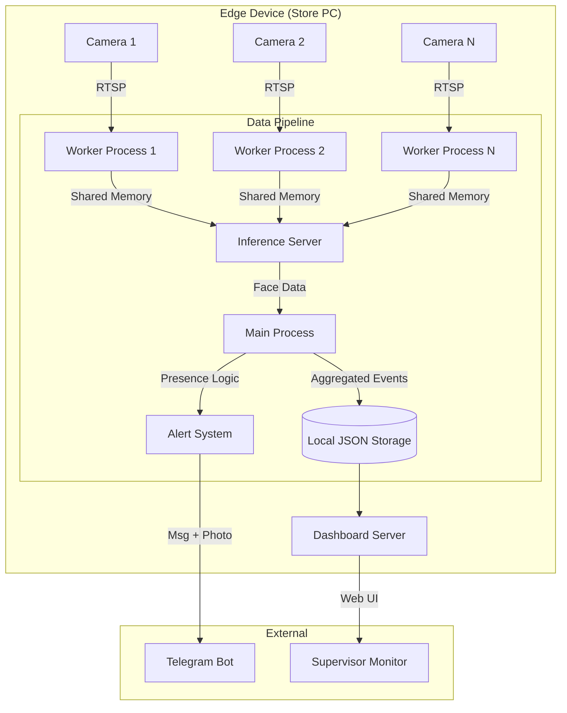

# SPG Attendance Monitoring System

Sistem pemantauan kehadiran SPG cerdas berbasis Face Recognition dengan dukungan Multi-Kamera, Real-time Dashboard, dan Notifikasi Telegram.

## System Flow



## Key Features

*   **Multi-Camera Support**: Menghubungkan banyak CCTV dalam satu outlet.
*   **Centralized AI**: Satu model AI melayani semua kamera (Hemat Resource).
*   **Real-time Dashboard**: Live view, status kehadiran, dan log event.
*   **Smart Alerts**: Notifikasi Telegram saat SPG tidak terlihat (Absent) atau belum datang (Never Arrived).
*   **Evidence**: Menyertakan foto snapshot saat alert dikirim.
*   **Robustness**: Auto-reconnect RTSP, Auto-restart crash, & Auto-degrade saat lag.

## Prerequisites

- Windows 10/11
- Python 3.10+ (via Conda recommended)
- CCTV Camera (RTSP) atau Webcam
- NVIDIA GPU (Optional, recommended for `buffalo_l` model)

## Setup

```bash
conda env create -f environment.yml
conda activate face_recog
copy .env.example .env
```

Isi `.env` dengan kredensial kamera dan Telegram token Anda.

## Quick Start

Jalankan sistem dalam mode **Demo** (menggunakan config `configs/app.dev.yaml`):

**Terminal 1 (Pipeline):**
```bash
make run-demo
```

**Terminal 2 (Dashboard):**
```bash
make dashboard-demo
```

Buka browser di `http://localhost:8000`.

## Configuration Guide

File konfigurasi utama ada di `configs/app.dev.yaml`. Beberapa setting penting:

*   **Recognition**:
    *   `model_name`: `buffalo_s` (Cepat) atau `buffalo_l` (Akurat).
    *   `det_size`: Resolusi input deteksi (e.g., `[640, 640]`).
*   **Performance**:
    *   `process_fps`: Target FPS (e.g., `8` - `12`).
    *   `frame_skip`: Skip frame untuk hemat CPU.
*   **Presence**:
    *   `absent_seconds`: Batas waktu sebelum dianggap Absent (e.g., `300` detik).

## Documentation

*   [System Spec](docs/00-spec.md)
*   [Architecture](docs/02-architecture.md)
*   [System Flow & Diagrams](docs/05-system-flow.md)
*   [Config Reference](docs/03-config-reference.md)
