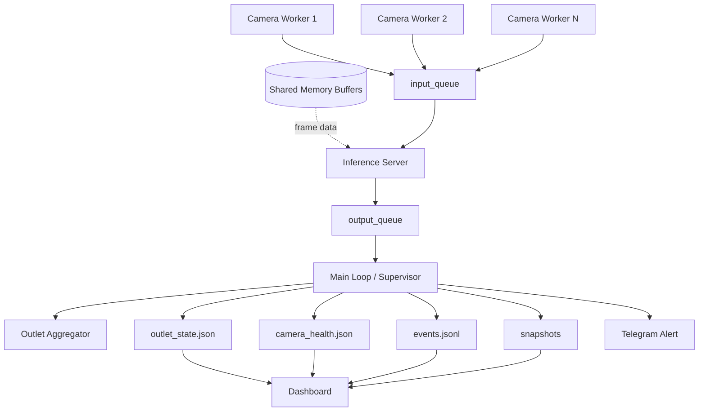

# SPG Attendance Monitoring (Face Recognition)

Sistem monitoring kehadiran SPG berbasis face recognition untuk mode multi-kamera outlet, dengan dashboard realtime dan notifikasi Telegram.

## Sistem Saat Ini

- Pipeline utama: **multi-camera centralized inference** (`run_outlet`)
- Dashboard FastAPI + UI monitoring + halaman **Manage SPG**
- Dukungan mode:
  - RTSP production/staging
  - simulasi video lokal
  - single webcam (debug/enroll/quick test)
- Self-healing:
  - restart worker/inference
  - restart budget guard
  - auto-degrade (`frame_skip`) saat lag tinggi

## Arsitektur Ringkas

```text
Camera Workers (N) -> Inference Server (1) -> Main Loop (Aggregator + Supervisor)
                                             -> JSON state/health/events + snapshots
Dashboard (FastAPI) membaca output JSON/JPEG tersebut untuk UI realtime.
```

## System Flow



## Prasyarat

- Windows 10/11
- Python 3.10+ (disarankan via Conda)
- Kamera RTSP atau webcam
- GPU NVIDIA (opsional, direkomendasikan untuk model besar)

## Setup

```bash
conda env create -f environment.yml
conda activate face_recog
copy .env.example .env
```

Isi `.env` minimal:

- `RTSP_CAM_01_URL` s.d. `RTSP_CAM_04_URL`
- `SPG_TELEGRAM_BOT_TOKEN` dan `SPG_TELEGRAM_CHAT_ID` (opsional jika notifikasi aktif)

## Menjalankan Sistem

### 1) Mode utama (multi-camera)

Terminal 1 (pipeline):

```bash
make run-demo
```

Terminal 2 (dashboard):

```bash
make dashboard-demo
```

Dashboard: `http://localhost:8000`

### 2) Profil staging / production

```bash
make run-staging
make dashboard-staging

make run-prod
make dashboard-prod
```

### 3) Simulasi video

```bash
make simulate
make simulate-light
```

### 4) Tool single-camera

```bash
make webcam
python -m src.app debug --config configs/app.dev.yaml
python -m src.app enroll --spg_id 001 --name "Nana" --samples 30 --config configs/app.dev.yaml
```

## Konfigurasi

Prioritas config:

1. argumen `--config`
2. env `APP_CONFIG_PATH`
3. env `APP_ENV` -> `configs/app.<env>.yaml` (default `dev`)

File profile:

- `configs/app.dev.yaml`
- `configs/app.staging.yaml`
- `configs/app.prod.yaml`

Referensi lengkap: [docs/03-config-reference.md](docs/03-config-reference.md)

## Data Runtime yang Dihasilkan

Basis path: `storage.data_dir`

- `<data_dir>/<sim_output_subdir>/outlet_state.json`
- `<data_dir>/<sim_output_subdir>/camera_health.json`
- `<data_dir>/<sim_output_subdir>/cam_XX/events.jsonl`
- `<data_dir>/<sim_output_subdir>/cam_XX/snapshots/latest_frame.jpg`
- `<data_dir>/<gallery_subdir>/*.json` dan `*_last_face.jpg`
- `<data_dir>/snapshots/*.jpg` (snapshot alert Telegram)

## Runtime Control (Hot Tuning)

Pipeline membaca file:

- `<data_dir>/<sim_output_subdir>/runtime_control.json`

Field yang didukung:

- `frame_skip`
- `min_consecutive_hits`
- `min_det_score`
- `min_face_width_px`
- `auto_degrade_enabled`

Contoh:

```json
{
  "frame_skip": 1,
  "min_consecutive_hits": 2,
  "min_det_score": 0.55,
  "min_face_width_px": 80,
  "auto_degrade_enabled": true
}
```

## Dokumentasi

- [docs/00-spec.md](docs/00-spec.md)
- [docs/01-mvp-checklist.md](docs/01-mvp-checklist.md)
- [docs/02-architecture.md](docs/02-architecture.md)
- [docs/03-config-reference.md](docs/03-config-reference.md)
- [docs/03-dashboard.md](docs/03-dashboard.md)
- [docs/04-enrollment-guidelines.md](docs/04-enrollment-guidelines.md)
- [docs/05-system-flow.md](docs/05-system-flow.md)
