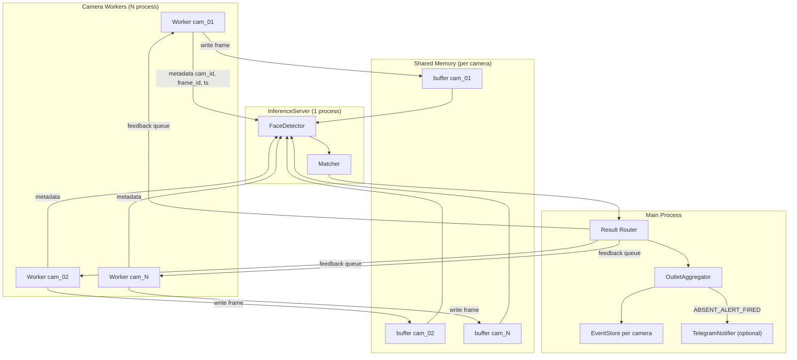
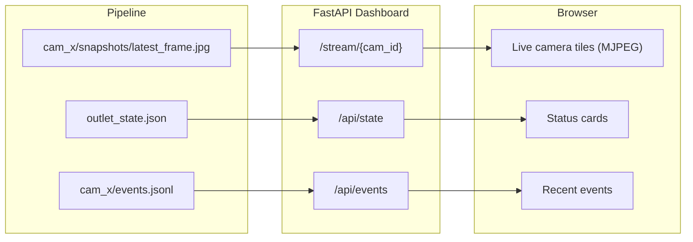

# System Flow and Runtime Architecture

Dokumen ini menjelaskan alur data aktual pada kode saat ini (terutama `run_outlet`, `InferenceServer`, dashboard FastAPI, dan mode simulasi).

---

## 1) Mode Operasi

### A. Single Camera (`python -m src.app run`)
- Menggunakan `run_webcam.py`.
- Detection + matching + presence berjalan dalam satu proses.
- Cocok untuk dev cepat (webcam / satu RTSP).

### B. Centralized Multi-Camera (`python -m src.commands.run_outlet`)
- Dipakai oleh:
  - `make run` (production RTSP dari `outlet.cameras`)
  - `make simulate` (video file dari `dev.video_files`)
- Arsitektur:
  - `N` camera worker process
  - `1` inference server process (model load sekali)
  - `1` main process (router + aggregator + alert)

---

## 2) Centralized Pipeline (Production and Simulate)



---

## 3) Step-by-Step Runtime Flow

1. Worker membaca frame dari source:
   - RTSP / webcam / video file (simulate mode).
2. Worker throttle output frame berdasarkan `camera.process_fps`.
3. Worker kirim frame ke inference:
   - Mode utama: tulis ke shared memory + kirim metadata ke `input_queue`.
   - Fallback: kirim frame langsung via queue jika shared memory gagal.
4. Inference server menerima item, lalu:
   - Optional skip frame dengan `inference.frame_skip`.
   - Jalankan detection + matching.
   - Kirim hasil ke `output_queue`.
5. Main process:
   - Broadcast hasil ke `feedback_queue` worker (untuk bbox overlay preview worker).
   - Simpan event matched ke `events.jsonl` per kamera.
   - Ingest ke `OutletAggregator` (ANY-of-N logic).
   - Fire absence alert ke Telegram (jika enabled).
   - Dump `outlet_state.json` untuk dashboard.
6. Worker menyimpan `latest_frame.jpg` berkala untuk dashboard stream.

---

## 4) Dashboard Data Flow



Catatan:
- Stream dashboard membaca file `latest_frame.jpg`, bukan stream RTSP langsung.
- Jadi FPS live dashboard ditentukan oleh interval simpan frame + interval baca stream.

---

## 5) Arsitektur Proses

```
[Main Process: run_outlet]
  |- InferenceServer (child process, model load sekali)
  |- CameraWorker cam_01 (child process)
  |- CameraWorker cam_02 (child process)
  |- ...
  `- Router + Aggregator loop

[Separate Process]
  `- FastAPI dashboard (make dashboard)
```

Total proses saat centralized mode:
- `1 main + 1 inference + N worker + 1 dashboard = N + 3`

---

## 6) Konfigurasi yang Mengatur Throughput

### `camera.process_fps`
- Lokasi: reader (`WebcamReader` dan `RTSPReader`).
- Berlaku di:
  - single webcam mode
  - production (`make run`)
  - simulate (`make simulate`)
- Fungsi: membatasi frame yang diteruskan ke pipeline (bukan kualitas kamera).

### `inference.frame_skip`
- Lokasi: `InferenceServer`.
- Fungsi: skip inference N frame antar proses inference.
- Efek: event/bbox update lebih jarang, beban inferensi turun.

### `runtime.preview_frame_save_interval_sec`
- Lokasi: worker.
- Fungsi: interval update `latest_frame.jpg` untuk dashboard.

### `dashboard.stream_frame_interval_sec`
- Lokasi: dashboard stream generator.
- Fungsi: interval pengiriman frame MJPEG ke browser.

FPS dashboard efektif kira-kira dibatasi oleh nilai paling kecil dari komponen di atas.

---

## 7) Simulate and Preview

### Simulate mode
- `make simulate` -> `python -m src.commands.run_outlet --simulate --preview`
- Source frame diambil dari `dev.video_files` pada config aktif.
- Jika semua path video invalid, pipeline tidak punya source valid dan tidak ada output.

### Preview window
- `--preview` sekarang aktif: worker akan menampilkan `cv2.imshow` per kamera.
- `--no-preview` tetap headless.
- Preview ini berbeda dengan dashboard stream (file-based MJPEG).

---

## 8) Presence Rule (ANY-of-N)

Untuk outlet multi-camera:
- SPG dianggap `PRESENT` jika terlihat di salah satu kamera.
- SPG dianggap `ABSENT` bila tidak terlihat di semua kamera lebih lama dari `presence.absent_seconds`.
- Alert absence di-fire sekali per periode absence, lalu reset saat SPG muncul kembali.

---

## 9) Known Constraints

1. `process_fps` tinggi tidak otomatis membuat dashboard 60 FPS.
2. Menurunkan `process_fps` menurunkan densitas sampling waktu:
   - aksi cepat bisa terlewat,
   - delay deteksi meningkat.
3. Menurunkan `process_fps` tidak menurunkan "kemampuan asli" CCTV; ini hanya rate pemrosesan di sisi aplikasi.
4. Jika shared memory gagal, sistem fallback ke queue mode (lebih berat CPU karena serialization).

---

## 10) Recommended Tuning Order

1. `recognition.threshold`
2. `recognition.min_consecutive_hits`
3. `presence.grace_seconds`
4. `camera.process_fps`
5. `inference.frame_skip`
6. `runtime.preview_frame_save_interval_sec` + `dashboard.stream_frame_interval_sec` (jika fokus UI smoothness)
