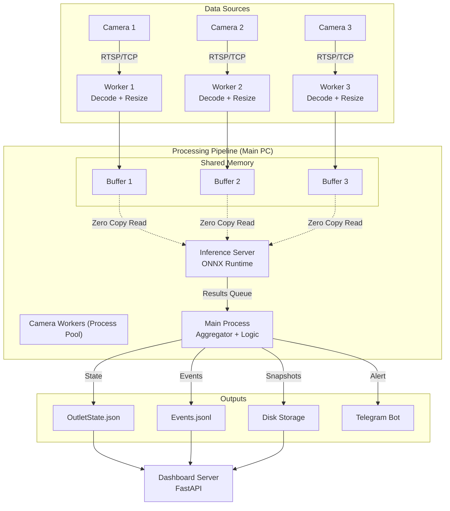

# System Flow and Runtime Architecture

Dokumen ini menjelaskan alur runtime aktual pada mode multi-camera centralized.

## System Architecture Diagram

```mermaid
graph TD
    subgraph "Data Sources"
        Cam1[Camera 1] -->|RTSP/TCP| Worker1
        Cam2[Camera 2] -->|RTSP/TCP| Worker2
        Cam3[Camera 3] -->|RTSP/TCP| Worker3
    end

    subgraph "Processing Pipeline (Main PC)"
        subgraph "Camera Workers (Process Pool)"
            Worker1[Worker 1<br>Decode + Resize]
            Worker2[Worker 2<br>Decode + Resize]
            Worker3[Worker 3<br>Decode + Resize]
        end

        subgraph "Shared Memory"
            SHM1[Buffer 1]
            SHM2[Buffer 2]
            SHM3[Buffer 3]
        end

        Worker1 --> SHM1
        Worker2 --> SHM2
        Worker3 --> SHM3

        InfServer[Inference Server<br>ONNX Runtime]
        SHM1 & SHM2 & SHM3 -.->|Zero Copy Read| InfServer

        InfServer -->|Results Queue| MainProc[Main Process<br>Aggregator + Logic]
    end

    subgraph "Outputs"
        MainProc -->|Events| JSON[Events.jsonl]
        MainProc -->|State| State[OutletState.json]
        MainProc -->|Snapshots| Disk[Disk Storage]
        MainProc -->|Alert| Telegram[Telegram Bot]
    end

    State & JSON & Disk --> Dashboard[Dashboard Server<br>FastAPI]
```

## 1. Operation Modes

### Single camera

- Command: `python -m src.app run`
- Flow: capture -> inference -> presence -> alert dalam satu proses.

### Multi-camera centralized

- Command:
  - `python -m src.commands.run_outlet --config <yaml>`
  - atau quick switch `make run-demo|run-staging|run-prod`
- Flow:
  - N camera workers
  - 1 inference server
  - 1 main process (router + aggregator + supervisor)

## 2. Main Pipeline

1. Worker membaca frame dari RTSP/webcam/file.
2. Worker throttle berdasarkan `camera.process_fps`.
3. Worker kirim metadata/frame ke inference:
   - shared memory mode (utama)
   - queue fallback mode
4. Inference server:
   - baca item queue
   - apply `frame_skip` (dinamis)
   - detect + match
   - kirim hasil ke output queue
5. Main process:
   - route feedback ke worker
   - generate event `SPG_SEEN`
   - ingest ke `OutletAggregator`
   - tick absence logic + alert
   - dump state dan health JSON

## 3. Self-Healing Supervisor

Main loop memonitor process:

- inference process
- worker per kamera

Jika mati:

- restart dengan cooldown `runtime.supervisor_restart_cooldown_sec`
- restart dibatasi `runtime.supervisor_max_restarts_per_minute`
- jika budget habis, worker/inference ditandai exhausted

## 4. Adaptive Degrade

Saat load tinggi (lag naik), main loop otomatis naikkan `frame_skip`.
Saat stabil kembali, `frame_skip` diturunkan.

Kontrol:

- `runtime.auto_degrade_enabled`
- `runtime.auto_degrade_lag_high_ms`
- `runtime.auto_degrade_lag_low_ms`
- `runtime.auto_degrade_high_streak`
- `runtime.auto_degrade_low_streak`
- `runtime.auto_degrade_max_frame_skip`

## 5. RTSP Failure Handling

`RTSPReader` memakai:

- reconnect exponential backoff
- jitter
- retry schedule non-blocking

Tujuan: mencegah reconnect storm saat jaringan tidak normal.

## 6. Dashboard Data Flow

Pipeline menghasilkan:

- `outlet_state.json`
- `camera_health.json`
- `cam_x/events.jsonl`
- `cam_x/snapshots/latest_frame.jpg`

Dashboard FastAPI membaca data ini lewat:

- `GET /api/state`
- `GET /api/events`
- `GET /api/health`
- `GET /stream/{cam_id}`

## 7. Stream Stability Notes

- Worker menulis preview JPEG secara atomic.
- Stream endpoint validasi basic JPEG boundary.
- Jika frame baru tidak valid, endpoint pakai last-good-frame.

## 8. Health Metrics

Per kamera:

- `status` (`LIVE`, `STALE`, `OFFLINE`)
- `processed_fps`
- `inference_time_ms`
- `queue_lag_ms`
- `last_result_age_sec`
- `worker_alive`
- `worker_restarts_last_minute`
- `restart_exhausted`

Global:

- `frame_skip`
- `base_frame_skip`
- status supervisor inference

## 9. Recommended Runtime Profiles

### Demo

- smooth UI
- `process_fps` lebih tinggi
- base `frame_skip` rendah

### Production

- hemat resource
- base `frame_skip` moderat
- auto-degrade aktif untuk spike handling
- preview width/quality lebih kecil
