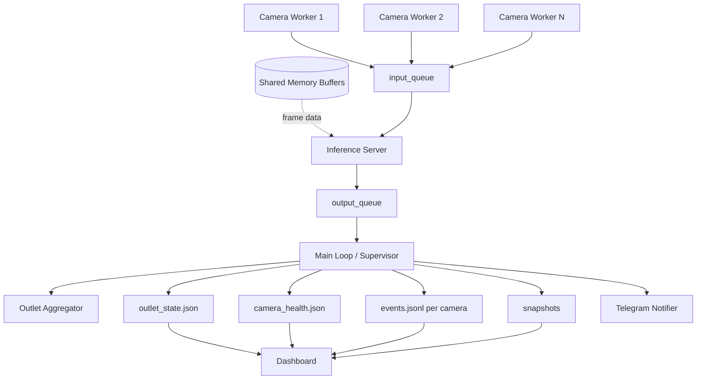

# System Flow

Dokumen ini menjelaskan alur runtime aktual mode outlet multi-camera.

## 1. Diagram Alur

```mermaid
graph TD
    Cam1[Camera Worker 1] --> InQ[input_queue]
    Cam2[Camera Worker 2] --> InQ
    CamN[Camera Worker N] --> InQ

    SHM[(Shared Memory Buffers)] -. frame data .-> INF[Inference Server]
    InQ --> INF
    INF --> OutQ[output_queue]
    OutQ --> MAIN[Main Loop / Supervisor]

    MAIN --> AGG[Outlet Aggregator]
    MAIN --> EV[events.jsonl per camera]
    MAIN --> STATE[outlet_state.json]
    MAIN --> HEALTH[camera_health.json]
    MAIN --> SNAP[snapshots]
    MAIN --> TG[Telegram Notifier]

    STATE --> DASH[Dashboard]
    HEALTH --> DASH
    EV --> DASH
    SNAP --> DASH
```

## 2. Startup Sequence (`run_outlet`)

1. Load config dan validasi `outlet`.
2. Tentukan source kamera:
   - RTSP outlet (normal)
   - video files (simulate mode)
3. Setup direktori output.
4. Jalankan snapshot cleaner.
5. Inisialisasi queue + shared memory buffers.
6. Spawn inference process.
7. Spawn worker process per kamera.
8. Masuk loop utama supervisor + aggregator.

## 3. Worker Flow

1. Capture frame dari source.
2. Throttle sesuai `camera.process_fps`.
3. Kirim metadata ke `input_queue`.
4. Tulis frame ke shared memory (atau queue fallback).
5. Terima feedback faces dari inference untuk overlay.
6. Simpan `latest_frame.jpg` (dan opsional `latest_raw_frame.jpg`).

## 4. Inference Flow

1. Load model detector.
2. Load gallery embeddings.
3. Ambil item dari queue.
4. Resolve frame (shared memory/queue payload).
5. Apply runtime gate:
   - frame skip
   - ROI
   - min detection score
   - minimum face width
6. Match embedding ke gallery.
7. Push result ke output queue.

## 5. Main Loop Flow

1. Pantau process hidup/mati.
2. Restart sesuai cooldown + budget.
3. Drain output queue (batch).
4. Bangun event `SPG_SEEN` setelah streak `min_consecutive_hits`.
5. Ingest event ke `OutletAggregator`.
6. Jalankan `tick()` aggregator untuk absence alert.
7. Kirim Telegram (message + snapshot) jika alert terjadi.
8. Hitung health metrics dan tulis JSON.
9. Dump state outlet.

## 6. Presence State Machine (Aggregator)

Per target SPG:

- `NOT_SEEN_YET` -> `PRESENT` saat pertama kali terlihat
- `NOT_SEEN_YET` -> `NEVER_ARRIVED` jika lewat `absent_seconds` tanpa detections
- `PRESENT` -> `ABSENT` jika tidak terlihat > `absent_seconds`
- `ABSENT` -> `PRESENT` saat terlihat lagi

Alert absence 1x per periode absence (anti-spam).

## 7. Health Metrics yang Dihasilkan

Global:

- `frame_skip`
- `base_frame_skip`
- `min_consecutive_hits`
- `min_det_score`
- `min_face_width_px`
- status inference supervisor

Per kamera:

- status `LIVE`/`STALE`/`OFFLINE`
- processed FPS
- inference ms
- queue lag ms
- capture->inference ms
- input queue wait ms
- post-inference queue ms
- last result age
- worker restart counters

## 8. Runtime Control

Main loop membaca:

- `<data_dir>/<sim_output_subdir>/runtime_control.json`

Field update realtime:

- `frame_skip`
- `min_consecutive_hits`
- `min_det_score`
- `min_face_width_px`
- `auto_degrade_enabled`

## 9. Dashboard Read Path

Dashboard membaca:

- `outlet_state.json`
- `camera_health.json`
- `cam_*/events.jsonl`
- `cam_*/snapshots/latest_frame.jpg`

Semua path mengikuti `storage.data_dir`, `storage.sim_output_subdir`, dan `storage.gallery_subdir`.
