# System Flow & Pipeline

Dokumen ini menjelaskan alur data (data flow) utama dalam sistem Face Recognition.

---

## 1. Enrollment Pipeline (Pendaftaran SPG)

Proses mendaftarkan wajah baru ke dalam sistem.

```mermaid
sequenceDiagram
    participant User
    participant Frontend as 🌐 Dashboard (Alpine.js)
    participant Backend as ⚡ FastAPI (main.py)
    participant Detector as 🧠 FaceDetector
    participant Store as 📁 GalleryStore

    User->>Frontend: Upload Foto / Capture Webcam
    Frontend->>Backend: POST /api/gallery/enroll (Multipart)
    
    activate Backend
    Backend->>Detector: detect(image)
    Detector-->>Backend: face_embedding, face_crop
    
    Backend->>Store: save_person(spg_id, embeddings)
    Backend->>Store: save_face_crop(spg_id, image)
    Backend-->>Frontend: Success (200 OK)
    deactivate Backend
    
    Frontend-->>User: Show Success & Update Table
```



**Keterangan:**
1.  **Input**: Gambar (JPG/PNG) dari upload atau webcam.
2.  **Processing**: `FaceDetector` (InsightFace) mendeteksi wajah & mengekstrak vektor (512-d).
3.  **Storage**: Vektor disimpan sebagai JSON, crop wajah disimpan sebagai JPG untuk UI.

---

## 2. Recognition Loop (Single Camera)

Proses deteksi dan pengenalan wajah realtime pada setiap kamera.

```mermaid
flowchart TD
    Cam[📹 Camera Source] --> |Frame (BGR)| Detect[🧠 FaceDetector]
    Detect --> |Face Embedding| Match[🔍 Matcher]
    
    subgraph "Vectorized Matching"
        Match --> |Compare vs Gallery| Matrix[🔢 Dot Product (NumPy)]
        Matrix --> |Score > Threshold| Result{IS MATCH?}
    end
    
    Result -- Yes --> SPG[🟢 SPG_SEEN Event]
    Result -- No --> Unknown[Unknown (Ignored)]
    
    SPG --> Log[📄 Event Log (events.jsonl)]
    SPG --> Presence[⏱️ Presence Engine]
```

**Key Components:**
-   **Configurable Model**: `buffalo_l` (ResNet) atau `buffalo_s` (MobileNet) via `app.dev.yaml`.
-   **Vectorized Matcher**: Menggunakan operasi matriks NumPy untuk membandingkan 1 wajah vs N gallery sekaligus (sangat cepat).

---

## 3. Presence & Alert Logic (Aggregator)

Bagaimana sistem menentukan SPG hadir (Present) atau hilang (Absent).


**Rules:**
1.  **Hit**: Satu frame terdeteksi valid.
2.  **Grace Period**: Toleransi kedipan mata / occlusion sebentar.
3.  **Absent**: Jika tidak ada *Hit* selama durasi `absent_seconds` (default 300s).
4.  **Alert**: Telegram message dikirim **hanya 1x** saat transisi ke ABSENT. Alert reset jika SPG kembali PRESENT.

---

## 4. Multi-Camera Aggregation (Outlet Level)

Jika outlet memiliki banyak kamera, status kehadiran digabungkan.

```mermaid
flowchart LR
    Cam1[Worker Cam 01] --> |Event| EventLog1[📄 events.jsonl]
    Cam2[Worker Cam 02] --> |Event| EventLog2[📄 events.jsonl]
    
    EventLog1 --> Aggregator[🔄 Outlet Aggregator]
    EventLog2 --> Aggregator
    
    Aggregator --> GlobalState{Global Presence?}
    
    GlobalState -- "Lost in ALL cams" --> Telegram[📱 Telegram Alert]
```



**Konsep**: **ANY-of-N**.
SPG dianggap **PRESENT** jika terlihat di mana pun (Kamera 1 ATAU Kamera 2).
SPG dianggap **ABSENT** hanya jika hilang dari **SEMUA** kamera secara bersamaan.
