# System Flow & Pipeline

Dokumen ini menjelaskan alur data (data flow) utama dalam sistem Face Recognition.

---

## 1. Enrollment Pipeline (Pendaftaran SPG)

Proses mendaftarkan wajah baru ke dalam sistem.

```mermaid
sequenceDiagram
    participant User
    participant Frontend as 🌐 Dashboard (Alpine.js)
    participant Backend as ⚡ FastAPI (main.py)
    participant Detector as 🧠 FaceDetector
    participant Store as 📁 GalleryStore

    User->>Frontend: Upload Foto / Capture Webcam
    Frontend->>Backend: POST /api/gallery/enroll (Multipart)
    
    activate Backend
    Backend->>Detector: detect(image)
    Detector-->>Backend: face_embedding, face_crop
    
    Backend->>Store: save_person(spg_id, embeddings)
    Backend->>Store: save_face_crop(spg_id, image)
    Backend-->>Frontend: Success (200 OK)
    deactivate Backend
    
    Frontend-->>User: Show Success & Update Table
```



**Keterangan:**
1.  **Input**: Gambar (JPG/PNG) dari upload atau webcam.
2.  **Processing**: `FaceDetector` (InsightFace) mendeteksi wajah & mengekstrak vektor (512-d).
3.  **Storage**: Vektor disimpan sebagai JSON, crop wajah disimpan sebagai JPG untuk UI.

---

## 2. Centralized Inference Pipeline (Multi-Camera)

Arsitektur utama produksi. **1 InferenceServer** melayani **N kamera** secara bersamaan.


### Data Flow Detail

1. **Camera Worker** membaca frame dari RTSP/webcam/video file
2. Frame ditulis ke **SharedMemory** (zero-copy, tanpa pickle)
3. Metadata ringan `(camera_id, frame_id, timestamp)` dikirim via `input_queue`
4. **InferenceServer** membaca frame dari SharedMemory, menjalankan detection + matching
5. Jika `frame_skip > 0`, N frame dilewati sebelum inference berikutnya
6. Hasil (bbox, spg_id, similarity) dikirim ke `output_queue`
7. **Main Process** mendistribusikan hasil:
   - → `feedback_queue[cam_id]` untuk visualisasi bbox di worker  
   - → `OutletAggregator` untuk logika kehadiran
8. Jika frame asli lebih besar dari buffer SharedMemory, worker **auto-resize** sebelum write
9. Bbox coordinates di-**scale balik** ke resolusi asli saat menggambar

> **⚠️ IMPORTANT**: Bbox dihitung pada frame yang di-resize (max 720p), 
> tapi digambar pada frame resolusi asli. Scale factor disimpan per-frame 
> untuk memastikan posisi bbox akurat.

---

## 3. Single Camera Mode (Dev/Debug)

Mode sederhana untuk testing. Model di-load langsung di proses yang sama.

```mermaid
flowchart TD
    Cam[📹 Camera Source] -->|Frame| Detect[🧠 FaceDetector]
    Detect -->|Face Embedding| Match[🔍 Matcher]
    
    subgraph vectorized["Vectorized Matching"]
        Match -->|Compare vs Gallery| Matrix[🔢 Dot Product]
        Matrix -->|"Score > Threshold"| Result{IS MATCH?}
    end
    
    Result -- Yes --> SPG[🟢 SPG_SEEN Event]
    Result -- No --> Unknown[Unknown]
    
    SPG --> Log[📄 events.jsonl]
    SPG --> Presence[⏱️ PresenceEngine]
```



> **Note**: Mode ini (`run_webcam.py`) load model per-proses. 
> Hanya untuk development. Untuk production, gunakan centralized mode.

---

## 4. Presence & Alert Logic

Bagaimana sistem menentukan SPG hadir atau hilang.


**Rules:**
1. **Hit**: Frame dengan face match yang valid.
2. **Grace Period**: Toleransi kedipan / occlusion sebentar (`grace_seconds`).
3. **Absent**: Tidak ada hit selama `absent_seconds` (default 300s production).
4. **Alert**: Telegram dikirim **hanya 1x** saat transisi ke ABSENT.
5. **ANY-of-N**: Pada multi-camera, SPG dianggap PRESENT jika terdeteksi di **salah satu** kamera.

---

## 5. Dashboard (Monitoring Realtime)


**FPS Budget:**

| Layer | Max FPS | Configurable |
|---|---|---|
| Camera capture | `process_fps` (5) | ✅ `camera.process_fps` |
| Inference | ~3-10 (tergantung GPU/CPU) | ✅ `inference.frame_skip` |
| Thumbnail save | ~1 FPS | Hardcoded (1x/sec) |
| MJPEG dashboard | ~5 FPS | `asyncio.sleep(0.2)` |

---

## 6. Process Architecture

```
[Main Process]
  ├── InferenceServer (child process)
  │   └── FaceDetector + Matcher (loaded once)
  ├── Camera Worker cam_01 (child process)
  ├── Camera Worker cam_02 (child process)
  ├── Camera Worker cam_03 (child process)
  ├── Camera Worker cam_04 (child process)
  └── Result Router + OutletAggregator (in main loop)

[Separate Process]
  └── FastAPI Dashboard (uvicorn)
```

**Total processes**: 1 (main) + 1 (inference) + N (cameras) + 1 (dashboard) = N + 3

---

## 7. Notes & Known Limitations

### Performance

- **SharedMemory max size**: Buffer dialokasi saat startup berdasarkan `max_frame_height × max_frame_width × 3`. Frame yang lebih besar akan di-resize otomatis.
- **`process_fps` terlalu tinggi** (>10) tidak berguna — inference dan dashboard tidak bisa consume secepat itu. Rekomendasi: 5 FPS.
- **`frame_skip`** berguna pada hardware lemah: `frame_skip=2` artinya proses 1 dari 3 frame.

### Koordinat Bbox

- Model inference berjalan pada frame yang sudah di-resize ke batas SharedMemory (max 720p).
- `det_size` (640×640) adalah resolusi internal InsightFace — independen dari ukuran frame input.
- Bbox di-scale balik ke resolusi asli saat menggambar → akurat selama `bbox_scale` di-track.

### Dashboard

- MJPEG stream menggunakan async generator dengan disconnect detection. Restart server → hard refresh browser (`Ctrl+Shift+R`) jika stuck.
- Click camera thumbnail untuk modal fullscreen.
- State di-poll setiap 3 detik — bukan realtime push.

### Config Security

- `configs/app.dev.yaml` di-gitignore (mengandung RTSP credentials).
- `configs/app.dev.yaml.example` di-commit sebagai template.
- Telegram secrets di `.env` (juga di-gitignore).

---

## 8. Edge Cases

| Case | Behavior | Mitigation |
|---|---|---|
| SharedMemory gagal create (OS limit) | Graceful fallback ke Queue mode (pickle) | Log warning, tetap jalan |
| Frame > buffer size | Auto-resize ke batas buffer | Transparent, no accuracy loss |
| InferenceServer crash | Main process detect `p_server.is_alive() == False`, exit | Perlu external supervisor (systemd) |
| Feedback queue full | `put_nowait` + catch `Full` → skip | Visualization lag, inference tetap jalan |
| Input queue full | Frame dropped (backpressure) | Normal behavior, tidak fatal |
| RTSP disconnect | RTSPReader auto-reconnect loop | Built-in di `rtsp_reader.py` |
| Gallery kosong | Matcher match selalu return `(False, None, 0.0)` | System tetap detect, tapi tidak match siapapun |
| Semua SPG absent di semua kamera | OutletAggregator fire 1 alert per SPG | Alert tidak duplikat |
| SPG re-entry setelah absent | Status reset ke PRESENT, alert bisa fire lagi | By design |

---

## 9. Future Improvements

| Priority | Improvement | Why |
|---|---|---|
| 🔴 High | Process supervisor (auto-restart crashed workers) | InferenceServer crash = system down |
| 🔴 High | Gallery hot-reload (tanpa restart server) | Enrollment baru belum ter-pickup sampai restart |
| 🟡 Medium | WebSocket push untuk dashboard (ganti polling) | Lebih responsive, kurang overhead |
| 🟡 Medium | GPU batch inference (batch frames dari multiple cameras) | ~2x throughput pada GPU |
| 🟢 Low | Database backend (SQLite/Postgres) untuk events | Scalability, query historical data |
| 🟢 Low | Metrics export (Prometheus) | Monitoring infrastructure |
| 🟢 Low | Liveness detection (anti-spoofing) | Security |
